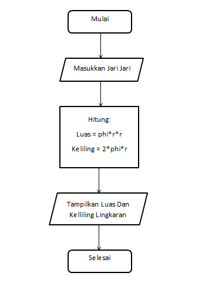
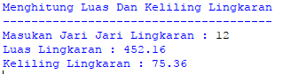

# Menghitung-Luas-Dan-Keliling-Lingkaran-Dengan-Python
## Rumus

Luas     = π × r²
Keliling = 2 x π × r

Nilai Phi yang akan kita gunakan adalah 3.14
r merupakan jari-jari lingkaran

Phi merupakan nilai konstanta di matematika sementara jari-jari merupakan jarak antara titik pusat dengan tepi lingkaran. Sebetulnya ada rumus lain untuk menghitung keliling lingkaran yaitu dengan menggunakan diameter, tapi pada kasus ini kita cukup menggunakan jari jari lingkaran saja.

## Flowchart

## Program

print("Menghitung Luas Dan Keliling Lingkaran")
print("--------------------------------------")
r = float(input("Masukan Jari Jari Lingkaran : "))

phi = 3.14
luas = phi*r *r
kel = 2*phi *r

print ("Luas Lingkaran :",format(luas,'.2f'))
print ("Keliling Lingkaran :",format(kel,'.2f'))

## Penjelasan

Pertama, disini kita akan mendeklarasikan variabel r serta memasukkan nilai jari-jari lingkaran bertipe float, disini kita akan menggunakan phi dengan nilai 3.14 dan mendeklarasikan variabel luas dimana nilai variabel phi dikali nilai variabel r lalu dikalikan lagi dengan variabel r dan hasilnya akan dimasukkan ke dalam variabel luas

Variabel keliling pun sama begitu, tetapi disini ada rumus yang berbeda yaitu 2 dikali variabel phi dan dikali nilai variabel r yang dimasukkan kedalam variabel kel dan yang terakhir menampilkan nilai dari variabel luas dan kel (keliling)

## Hasil

## Selesai
